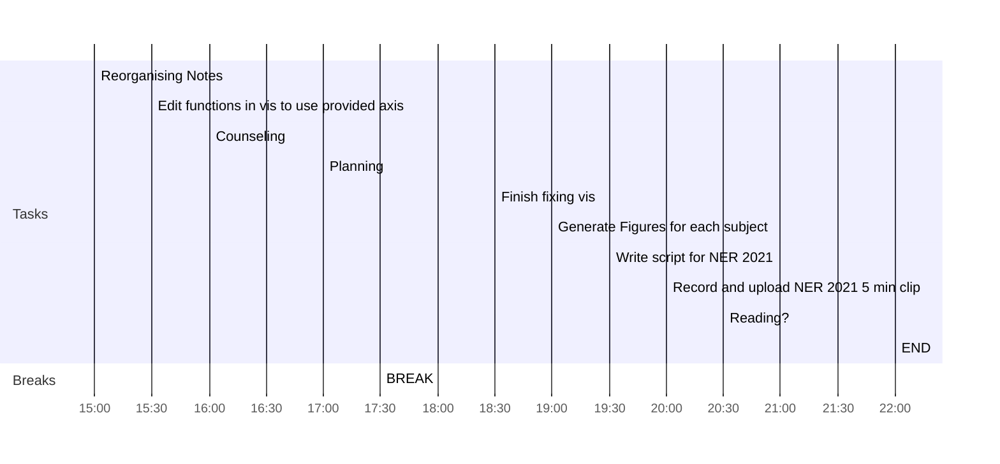

## Day Planner

- [x] 15:00 Reorganising Notes
- [x] 15:30 Edit functions in vis to use provided axis
- [x] 16:00 Counseling
- [x] 17:00 Planning
- [x] 17:30 BREAK
- [x] 18:30 Finish fixing vis
- [x] 19:00 Generate Figures for each subject
- [x] 19:30 Write script for NER 2021
- [x] 20:00 Record and upload NER 2021 5 min clip
- [x] 20:30 Reading?
- [ ] 22:00 END