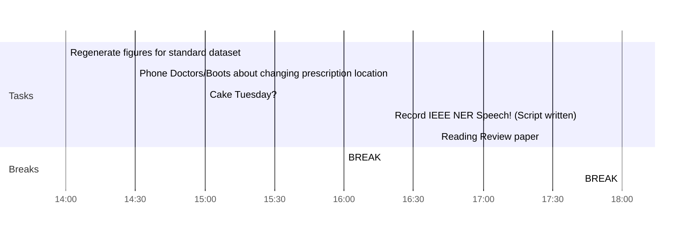

## Day Planner


- [x] 14:00 Regenerate figures for standard dataset
- [x] 14:30 Phone Doctors/Boots about changing prescription location
- [x] 15:00 Cake Tuesday?
- [x] 16:00 BREAK
- [x] 16:20 Record IEEE NER Speech! (Script written)
- [x] 16:40 Reading Review paper
- [x] 18:00 BREAK
- [ ] 18:00 More Reading
- [ ] 20:00 BREAK
- [ ] 20:30 More reading?


```python
for x in range(1, 30):
	print(x)
```